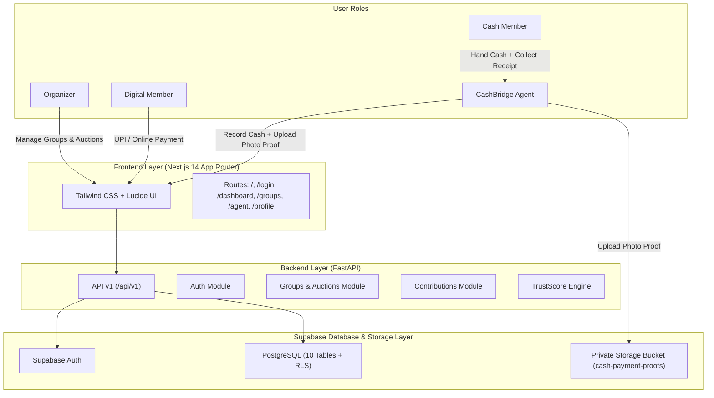

# ChitTrust + CashBridge 🪙🤝

> **Financial Inclusion Platform for Mixed Digital + Cash-Based Community Committees (Chit Funds / SHGs) in India**

---

## 📌 Project Overview

**ChitTrust + CashBridge** is a hackathon-ready financial inclusion platform built specifically for informal and semi-formal community savings groups (Chit Funds, ROSCAs, Self-Help Groups) across urban and rural India.

It bridges the gap between **digital-first members** (who prefer UPI/online payments) and **cash-based micro-savers** (who lack digital literacy or banking access), creating a **unified Trust Score** that treats digital and verified cash contributions with equal credit weight.

---

## 🎯 Problem Statement

1. **Digital Exclusion in Community Chits**: Over 60% of rural and semi-urban community savings participants prefer or depend on cash. Traditional digital fintech platforms force users to adopt UPI, excluding cash members.
2. **Trust & Accounting Gaps**: Informal cash collections by local organizers lead to disputes, lost records, and lack of audit trails.
3. **Invisible Credit History**: Cash-based micro-savers contribute reliably for years but receive zero credit score benefit because their savings remain unrecorded in formal financial credit bureaus.

---

## 💡 Solution

- **Dual-Mode Contribution System**: Digital members pay via UPI/Razorpay; Cash members pay doorstep **CashBridge Agents**.
- **Photo-Verified Doorstep Receipts**: Agents collect cash, snap photo proof of the transaction + physical receipt, and instantly digitize the payment.
- **Equal-Weight TrustScore**: System rewards on-time cash payments identically to digital payments, producing a verifiable community trust rating.
- **Multi-Role Portal**: Dedicated dashboards for **Organizers**, **Digital Members**, **Cash Members**, and **CashBridge Agents**.

---

## 🏗️ System Architecture



---

## 🗄️ Database Architecture & RLS Security (Phase 2 Completed)

For complete table definitions, foreign keys, and RLS matrices, see [docs/database.md](file:///c:/Users/sapna%20jha/ChitTrust%20—%20CashBridge/docs/database.md).

### Core Tables Summary
- `profiles`: User profiles mirroring `auth.users` with domain roles (`organizer`, `member`, `agent`, `admin`).
- `groups`: Community chit funds with total pool, duration, and monthly payment constraints.
- `memberships`: Associates users with groups. Cash members MUST have an assigned `agent_id`.
- `agents`: Verification profiles and reputation metrics for doorstep CashBridge agents.
- `contributions`: Monthly payment receipts with strict mode validation (Cash requires photo proof/agent confirmation).
- `payouts`: Monthly auction prize disbursements.
- `trust_scores`: Unified credit rating starting at 100 with on-time metrics.
- `auctions` & `auction_bids`: Monthly bidding rounds and bidding history.
- `audit_logs`: Immutable audit trail for financial traceability.

### RLS & Security Highlights
- **100% RLS Coverage**: All 10 tables have Row Level Security enabled.
- **Private Storage**: `cash-payment-proofs` bucket is private; only verified agents can upload, and group members/organizers can view receipt images.
- **Automatic User Provisioning**: PostgreSQL trigger `handle_new_user()` automatically creates user profiles and initializes trust scores upon Supabase Auth registration.

---

## 🛠️ Tech Stack

### Frontend
- **Framework**: Next.js 14+ (App Router)
- **Language**: TypeScript
- **Styling**: Tailwind CSS
- **Icons**: Lucide React

### Backend & Database
- **Framework**: FastAPI (Python 3.11+)
- **Validation**: Pydantic v2 & Pydantic Settings
- **Database**: Supabase PostgreSQL + Auth + Storage
- **Security**: Row Level Security (RLS) & Pgcrypto

---

## ⚡ Migration & Database Setup Instructions

### 1. Execute SQL Migrations in Supabase
Copy the contents of [supabase/migrations/000_full_schema.sql](file:///c:/Users/sapna%20jha/ChitTrust%20—%20CashBridge/supabase/migrations/000_full_schema.sql) and run it in the **Supabase SQL Editor**.

Alternatively, execute individual numbered migration scripts in sequence:
`001_extensions.sql` ➔ `002_enums.sql` ➔ `003_profiles.sql` ➔ ... ➔ `017_seed.sql`.

### 2. Validate Schema Integrity
Run the backend schema validator script:
```bash
cd backend
.venv\Scripts\python scripts\validate_schema.py
```

---

## ⚡ Quick Start & App Setup Instructions

### 1. Frontend Setup

```bash
cd frontend

# Install dependencies
npm install

# Run development server
npm run dev
```

### 2. Backend Setup

```bash
cd backend

# Activate virtual environment (Windows PowerShell)
.venv\Scripts\Activate.ps1

# Run FastAPI backend server
python run.py
```

The API will be available at `http://localhost:8000`.
- Health Check: `GET http://localhost:8000/api/v1/health`

---

## 📈 Development Roadmap & Planned Phases

- [x] **Phase 1: Project Foundation** (Tech Stack, Modular Layout, Routing, Health Check, Types, Documentation)
- [x] **Phase 2: Database Schemas, RLS Security, Triggers & Storage** (10 Tables, 9 Enums, Triggers, RLS, Storage Bucket)
- [ ] **Phase 3: Dual Contribution & CashBridge Agent Verification Workflows**
- [ ] **Phase 4: TrustScore Calculation Engine & Auction Bidding Engine**
- [ ] **Phase 5: Razorpay UPI & Twilio SMS Alerts Integration**
- [ ] **Phase 6: Groq Multilingual Voice AI Assistance for Low-Literacy Users**

---

## ⚖️ Legal & Compliance Disclaimer

> [!IMPORTANT]
> **Hackathon MVP Notice**: This database schema is designed for hackathon demonstration and prototype execution. Real-world deployment requires formal compliance under India's **Chit Funds Act, 1982** and applicable state amendments.
