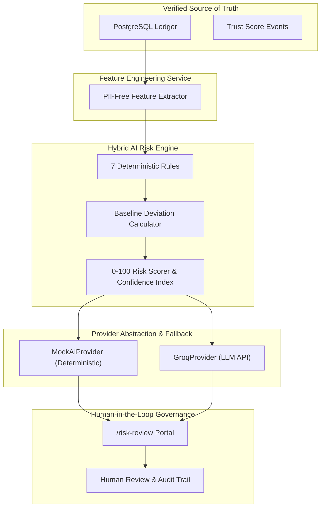

# AI Trust Intelligence Layer Architecture 🤖🧠

## Overview

The **AI Trust Intelligence Layer** augments ChitTrust's verified ledger with explainable operational risk signals, conversational voice assistance, and Group Health analytics.

---

## 🏛️ AI Subsystem Architecture



---

## 🔒 Three-Concept Separation

```text
Trust Score   : Member behavioral reliability index (Base 100+). Updated ONLY by verified contributions.
Risk Score    : Operational anomaly review signal (0-100: Low, Medium, High, Critical).
AI Confidence : Statistical model confidence (0.00 to 1.00, e.g., 0.86).
```

- **Strict Isolation Principle**: Creating, reviewing, or resolving an AI Risk Assessment **NEVER automatically modifies or degrades a member's Trust Score**.
