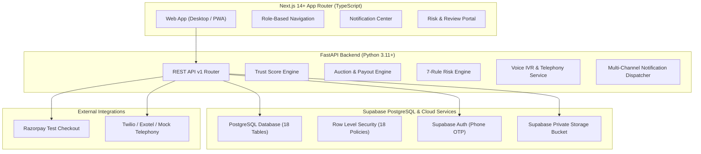

# System Architecture Specification 🏗️

## Overview

**ChitTrust + CashBridge** is a hybrid digital + cash financial inclusion platform built for community savings committees (Chit Funds / SHGs) in India.

---

## 🏛️ High-Level System Architecture



---

## 📁 Repository Sitemap

```text
ChitTrust — CashBridge/
├── backend/
│   ├── app/
│   │   ├── api/v1/endpoints/  # REST Endpoints (health, users, groups, contributions, auctions, payouts, analytics, risk, notifications, voice)
│   │   ├── core/               # App configuration, security, CORS, & exceptions
│   │   ├── schemas/            # Pydantic schemas (auction, payout, analytics, risk, notification)
│   │   └── services/           # Business logic (TrustScore, Auction, Payout, RiskEngine, Notification, Voice)
│   └── run.py                  # Uvicorn ASGI server entrypoint
├── frontend/
│   ├── app/                    # Next.js App Router (dashboard, groups, risk, notifications, profile, dev/voice-demo, privacy, terms)
│   ├── components/             # React UI Components (auction, analytics, risk, voice, common, ui)
│   └── hooks/                  # Custom React hooks (useAuth)
├── supabase/
│   └── migrations/             # 26 PostgreSQL migration files (000_full_schema.sql - 025_analytics_notifications_risk.sql)
└── docs/                       # Comprehensive documentation (security-audit, architecture, database-audit, security-scorecard, demo-script)
```
