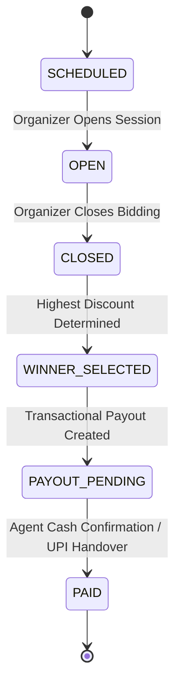

# Monthly Auction & Payout Engine Specification 🏆💰

## Overview

**ChitTrust + CashBridge** features an **auditable, deterministic Monthly Auction & Payout Engine** that executes the monthly savings cycle across community committees.

Eligible members submit bid discounts or participate in server-side lucky draws. The highest valid discount wins the auction, generating an exact net payout:

$$\text{Net Payout Amount} = \text{Total Pot} - \text{Winning Bid Discount}$$

---

## 🧮 Auction Rules & Monetary Precision

```text
Group Monthly Pot: ₹10,000
Monthly Contribution: ₹1,000 per member

Member Bids:
Member A: ₹1,500 discount
Member B: ₹1,200 discount
Member C: ₹1,000 discount

Winner: Member A (Highest Discount ₹1,500)
Net Payout = ₹10,000 - ₹1,500 = ₹8,500
```

- **Money Precision**: Backend monetary calculations use Python `Decimal` fixed-point arithmetic (never `float`).
- **Tie-Breaker**: If multiple members submit identical highest discounts, the earliest valid bid wins.
- **Lucky Draw**: Server-side random selection among eligible active members.

---

## 🔄 Auction & Payout Lifecycle State Machine



---

## 🤝 CashBridge Doorstep Cash Payout Handover

For cash winners, the organizer assigns a verified **CashBridge Agent** to deliver the physical cash payout:

1. Organizer assigns agent via `POST /api/v1/payouts/{payout_id}/assign-agent`.
2. Verified agent delivers cash handover to recipient winner.
3. Agent confirms handover via `POST /api/v1/payouts/{payout_id}/cash-confirm` with mandatory photo proof.
4. Payout status updates to `paid` and issues an in-app receipt notification to the recipient member.

---

## 🗣️ Voice IVR Integration (Phase 8 Compatibility)

Authenticated phone callers can query auction and payout statuses via Voice IVR:
- **`AUCTION_RESULT`**: *"Is mahine ka auction complete ho gaya hai. Payout amount ₹8,500 hai aur winner Anil Verma hain."*
- **`PAYOUT_STATUS`**: *"Aapka ₹8,500 ka payout status pending/paid hai."*

---

## 🧪 Automated Test Cases

| Scenario | Input | Expected Output | Status |
| :--- | :--- | :--- | :--- |
| **Test 1: Open Auction** | Month 3, Authorized Organizer | Auction state `open` | PASSED |
| **Test 2: Place Bid** | Bid discount = ₹1,500 | Bid recorded, highest discount updated | PASSED |
| **Test 3: Invalid Bid** | Bid discount = -₹100 or ₹12,000 | Rejected with 400 Bad Request | PASSED |
| **Test 4: Close Auction** | Bids: ₹1,500 vs ₹1,200 | Winner = Member A, Payout = ₹8,500 | PASSED |
| **Test 5: Cash Payout Confirm**| Verified Agent photo proof | Payout status `paid` | PASSED |
