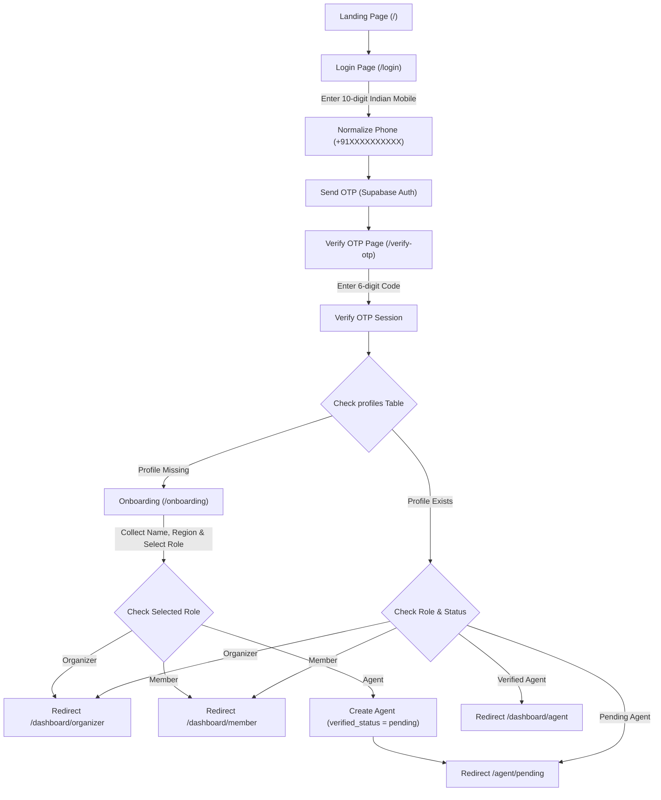

# Authentication, Onboarding & Role Security Specification 🔑

## Overview

**ChitTrust + CashBridge** uses **Supabase Auth** with Phone OTP verification as the single source of truth for user identity.

This document outlines the authentication lifecycle, phone normalization rules, profile setup, role-based navigation, privilege escalation safeguards, and Next.js middleware protection.

---

## 🔄 Authentication & Onboarding Lifecycle

---

## 📱 Phone Number Normalization & Validation

- **Standard Format**: `+91XXXXXXXXXX` (13 characters).
- **Validation**: Ensures 10 digits starting with `6, 7, 8, or 9` (standard Indian mobile series).
- **Prevention**: Prevents duplicate profile creation due to whitespace or national/international formatting differences.

---

## 🛡️ Role Security & Privilege Escalation Safeguards

1. **Self-Selected Roles Allowed**:
   - `member`: Standard chit group participant.
   - `organizer`: Manager of chit groups and auctions.

2. **Privilege Escalation Protection**:
   - **`admin`**: CANNOT be self-selected under any circumstances. Admin access is controlled exclusively via backend service-role operations.
   - **`agent`**: Users selecting "CashBridge Agent" during onboarding receive a profile with `user_type = 'agent'`, but an `agents` record is created with `verified_status = 'pending'`.
   - **Pending Agent Isolation**: Unverified agents cannot access doorstep cash collection tools and are directed to `/agent/pending`.

---

## 🔒 Route Protection & Next.js Middleware Matrix

| Path | Access Level | Description |
| :--- | :--- | :--- |
| `/` | Public | Hero landing page and product introduction. |
| `/login` | Public | Phone OTP request page. |
| `/verify-otp` | Public | 6-digit OTP verification page. |
| `/onboarding` | Authenticated | Profile setup page for new accounts. |
| `/dashboard` | Authenticated | Root dashboard redirector (detects role & status). |
| `/dashboard/organizer` | Organizer Role | Organizer overview and group management. |
| `/dashboard/member` | Member Role | Member savings, upcoming due date, live TrustScore. |
| `/dashboard/agent` | Verified Agent | Cash collection tools and reputation score. |
| `/agent/pending` | Pending Agent | Application under review notice. |
| `/profile` | Authenticated | User profile management and basic editable info. |

---

## 🤝 Trust Score Equality Principle

When a user profile is created during onboarding, a corresponding record in `trust_scores` is automatically initialized with a starting score of **100**.
The trust score treats cash and digital contributions equally, granting identical credit weight regardless of payment channel.
