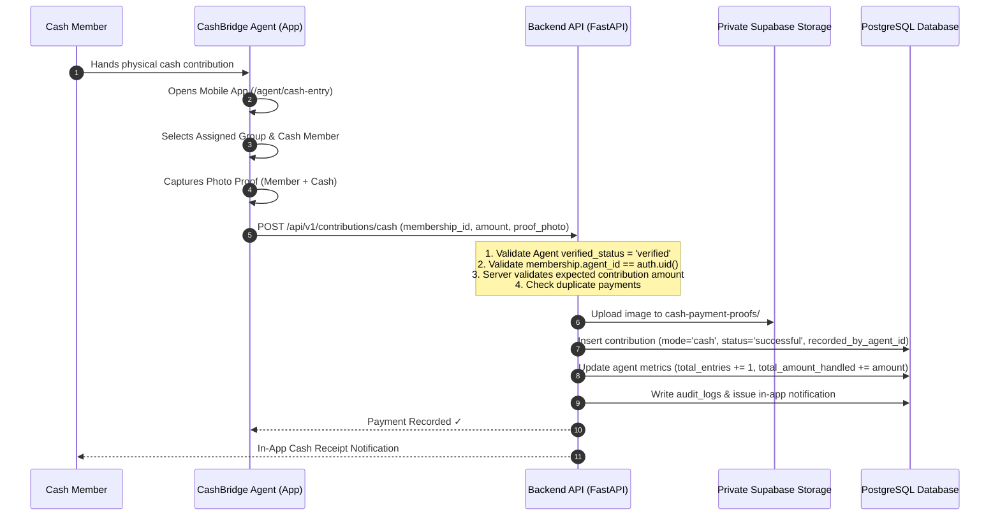

# CashBridge Cash Contribution & Agent Proof Subsystem Specification 💵📸

## Overview

**CashBridge** is the core differentiating subsystem of ChitTrust, providing a mobile-first, database-backed doorstep cash collection workflow for cash-based micro-savers in India.

Cash members hand physical currency to a verified **CashBridge Agent**, who captures mandatory photo proof, securely uploads the image to private Supabase Storage, and issues an atomic cash contribution record.

---

## 🔄 Cash Contribution Lifecycle

---

## 🔒 Security & Authorization Rules

1. **Agent Verification Guard**: Only agents with `verified_status = 'verified'` can record cash payments.
2. **Assignment Enforcement**: The backend verifies `membership.agent_id == authenticated_agent_id`. Agent A cannot record payments for members assigned to Agent B.
3. **Amount Validation**: The expected contribution amount is calculated server-side from `groups.contribution_per_month` (e.g. ₹2,500). Mismatched amounts are rejected.
4. **Duplicate Protection**: A member can only have one successful contribution per cycle month. Database-level uniqueness prevents duplicate records.
5. **Permanent Agent Attribution**: Table `contributions` permanently stores `recorded_by_agent_id` for dispute resolution.

---

## 📸 Private Proof Storage & Signed URL Access Control

- **Storage Bucket**: Private bucket `cash-payment-proofs` (`cash-payment-proofs/group/{group_id}/membership/{membership_id}/{contribution_id}.jpg`).
- **Public Access**: Public bucket access is strictly **disabled**. Direct public image URLs are forbidden.
- **Signed Access URLs**: Authorized users (Member, Organizer, Recording Agent) request short-lived 15-minute signed access URLs via `GET /api/v1/contributions/{id}/proof-url`.

---

## 📜 Complete Data Traceability Model

Every cash contribution answers:
- **Who paid?** → `membership.user_id` / `profiles`
- **How much?** → `contributions.amount`
- **When?** → `contributions.payment_date`
- **Which month?** → `contributions.month_number`
- **How?** → `contributions.mode = 'cash'`
- **Who recorded it?** → `contributions.recorded_by_agent_id`
- **Where is proof?** → `contributions.photo_proof_url`
- **Was it confirmed?** → `contributions.payment_status = 'successful'`
- **Audit history?** → `audit_logs` entry `cash_contribution_recorded`

---

## ⚖️ Legal & Privacy Notice

> [!NOTE]
> Payment proof images are stored securely in private storage and used strictly for transaction verification and dispute resolution.
