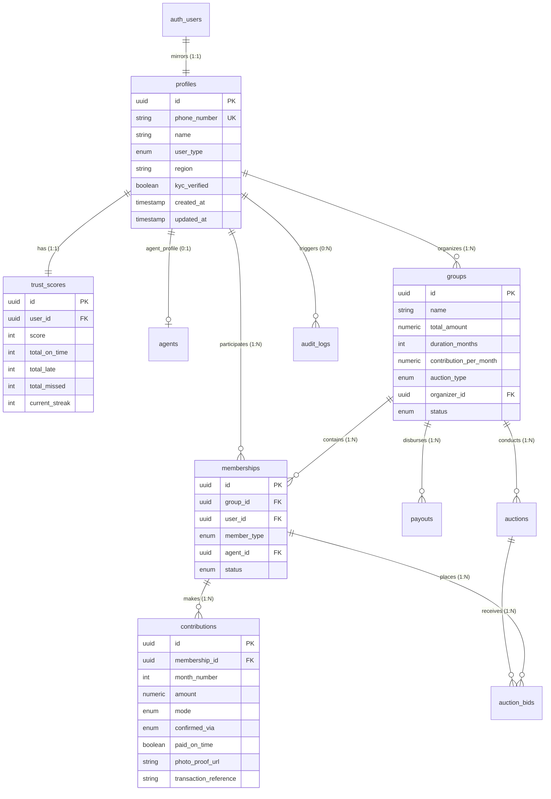

# Database Architecture & Security Specification 🗄️🔒

## Overview

**ChitTrust + CashBridge** uses Supabase PostgreSQL with strict Row Level Security (RLS), foreign key constraints, custom triggers, and private object storage buckets.

This document details the database schema, table relationships, security policies, storage layout, migration workflow, and legal compliance considerations.

---

## 📐 Entity Relationship (ER) Diagram

---

## 🗂️ Tables Overview & Key Constraints

| Table Name | Description | Key Constraints & Validation Rules |
| :--- | :--- | :--- |
| `profiles` | Mirrors `auth.users` with domain metadata & role. | `phone_number` UNIQUE, `id` FK ON DELETE CASCADE. |
| `groups` | Community chit funds created by organizers. | `total_amount > 0`, `duration_months > 0`, `contribution_per_month <= total_amount`. |
| `memberships` | User participation in groups as digital or cash. | Cash members MUST have an assigned `agent_id`. Unique `(group_id, user_id)` active pair. |
| `agents` | Verification & cash collection metrics for agents. | `reputation_score` between 0 and 100, `total_entries >= 0`. |
| `contributions` | Monthly payment receipts (cash or UPI). | Unique `(membership_id, month_number)`. Cash entries require photo proof or agent confirmation. |
| `payouts` | Monthly winner prize disbursements. | Unique `(group_id, month_number)`. `auction_discount >= 0`. |
| `trust_scores` | Unified credit & trust score rating. | Unique `user_id`, `score >= 0`. Starts at 100 upon registration. |
| `auctions` | Monthly bidding rounds per chit group. | Unique `(group_id, month_number)`. |
| `auction_bids` | Member bids for discount allocation. | `bid_discount >= 0`. |
| `audit_logs` | Immutable audit trail for financial traceability. | Append-only. Updates & deletes blocked. |

---

## 🔐 Row Level Security (RLS) Matrix

RLS is enabled on **100% of tables**.

| Table | SELECT Policy | INSERT Policy | UPDATE Policy | DELETE Policy |
| :--- | :--- | :--- | :--- | :--- |
| `profiles` | Own profile OR Group members (if Organizer) | Auth Trigger (`handle_new_user`) | Own profile (basic fields only) | Blocked (Cascades on auth delete) |
| `groups` | Group members OR Organizer | Organizer only | Organizer only | Organizer only |
| `memberships` | Self OR Group Organizer | Organizer only | Organizer only | Organizer only |
| `agents` | Self OR Public (if verified) | Service Role / Admin | Self (metrics updated by trigger/system) | Blocked |
| `contributions` | Self OR Group Organizer OR Assigned Agent | Verified Agent (Cash) / System (UPI) | Blocked (Immutable ledger) | Blocked |
| `payouts` | Group members OR Organizer | Organizer / System | Blocked | Blocked |
| `trust_scores` | Self OR Group Organizer | System Trigger | System Engine only (Users cannot modify) | Blocked |
| `auctions` | Group members & Organizer | Organizer | Organizer | Blocked |
| `auction_bids` | Group members & Organizer | Eligible Group Members | Blocked | Blocked |
| `audit_logs` | Own actor entries / Admin | Authenticated users (Append-only) | Blocked | Blocked |

---

## 🪣 Supabase Private Storage Strategy

- **Bucket Name**: `cash-payment-proofs`
- **Visibility**: **Private** (`public = false`). Unauthenticated public URLs are disabled.
- **Allowed MIME Types**: `image/jpeg`, `image/png`, `image/webp`, `image/heic`
- **Max File Size**: 10MB
- **Security Policy**: Only verified agents (`verified_status = 'verified'`) can upload receipt photo proofs. Only authenticated group members & organizers can view proof images.

---

## 🔄 Automatic Database Triggers

1. **`update_updated_at_column()`**:
   - Automatically maintains `updated_at = NOW()` on `profiles`, `groups`, and `agents`.

2. **`handle_new_user()`**:
   - Triggers immediately after an `auth.users` row is inserted.
   - Automatically populates `public.profiles` with `user_type = 'member'`.
   - Automatically initializes `public.trust_scores` with default `score = 100`.

---

## 🤝 Core Product Principle: Payment Equal Weight

The database treats cash and digital payment modes as **100% equal** for trust-score calculation.
While `contributions.mode` records whether a contribution was paid via `cash` or `upi` for audit transparency, the `trust_scores` system evaluates on-time payments identically regardless of payment channel.

---

## ⚖️ Legal & Compliance Disclaimer

> [!IMPORTANT]
> **Hackathon MVP Notice**: This database schema is designed for hackathon demonstration and prototype execution. Deploying a community chit fund or micro-financing platform in production within India requires formal registration and compliance under the **Chit Funds Act, 1982** (and respective state amendments), as well as RBI guidelines for peer-to-peer financial activities and micro-finance services.
