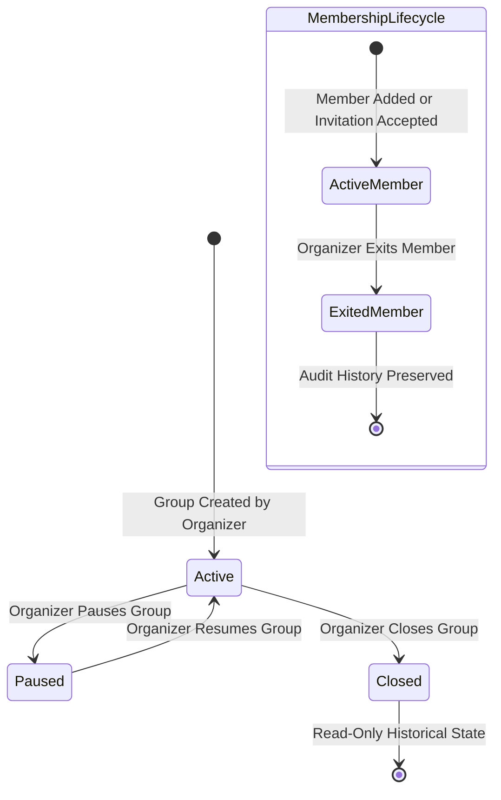

# Groups & Membership Management Specification 👥🤝

## Overview

**ChitTrust + CashBridge** provides a complete group administration lifecycle allowing **Organizers** to create community chit funds, invite digital and cash members, assign verified **CashBridge Agents**, and manage group states securely.

This document details the group and membership lifecycles, financial pool validation, cash vs digital flows, and access control matrices.

---

## 🔄 Group & Membership Lifecycles

---

## 💳 Digital vs Cash Member Workflow Rules

### 1. Digital Member Flow
- **Payment Method**: UPI / Online Payment Gateway.
- **Agent Requirement**: **`agent_id = NULL`**. Digital members manage payments directly through the platform.

### 2. Cash Member Flow
- **Payment Method**: Doorstep Cash Collection.
- **Agent Requirement**: **MUST** have an assigned CashBridge Agent (`agent_id IS NOT NULL`).
- **Agent Verification Guard**: Only agents with `verified_status = 'verified'` can be assigned. Unverified or pending agents cannot be assigned to cash members.

---

## 📩 Non-Registered User Invitation Workflow (`group_invitations`)

When an organizer adds a phone number not yet registered on the platform:
1. System checks `profiles` table for matching `phone_number`.
2. If profile is not found, an entry is created in `group_invitations` (`status = 'pending'`).
3. When the user subsequently registers via Phone OTP login, the onboarding system converts pending invitations into active memberships.

---

## 🔒 Authorization & Security Matrix

| Action | Organizer | Member | Verified Agent | Unverified Agent |
| :--- | :--- | :--- | :--- | :--- |
| `Create Group` | ✅ Allowed | ❌ Forbidden | ❌ Forbidden | ❌ Forbidden |
| `Edit / Pause / Close Group` | ✅ Allowed (Own Groups) | ❌ Forbidden | ❌ Forbidden | ❌ Forbidden |
| `Add Member / Invite` | ✅ Allowed (Own Groups) | ❌ Forbidden | ❌ Forbidden | ❌ Forbidden |
| `Exit Member` | ✅ Allowed (Own Groups) | ❌ Forbidden | ❌ Forbidden | ❌ Forbidden |
| `View Group Dashboard` | ✅ Own Groups | ✅ Joined Groups | ✅ Assigned Groups | ❌ Forbidden |

---

## 💰 Monetary & Financial Validation

- `total_amount > 0`
- `duration_months > 0`
- `contribution_per_month > 0`
- `contribution_per_month <= total_amount`
- All financial calculations use decimal-safe numeric handling without JavaScript floating-point errors.
