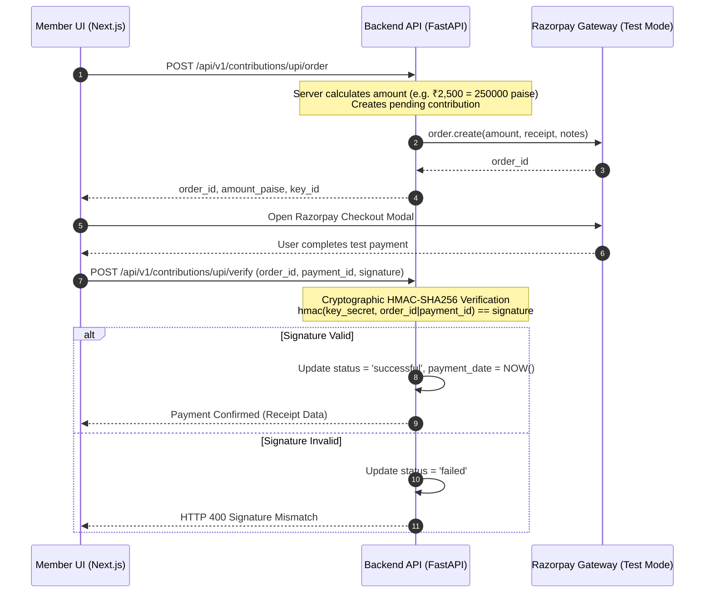

# Digital Contributions & Razorpay Test Payments Specification 💳🔒

## Overview

**ChitTrust + CashBridge** integrates **Razorpay Test Mode** for digital UPI monthly chit contributions.

This document details the payment security architecture, server-side amount calculation, cryptographic HMAC-SHA256 signature verification, webhook processing, idempotency guarantees, and payment state transitions.

---

## 🔒 Critical Security Principles

1. **Never Trust the Client**: Frontend callback (`payment successful`) is never trusted to confirm a contribution. Contributions are marked `successful` **only** after independent server-side HMAC-SHA256 signature verification or webhook validation.
2. **Server-Side Amount Calculation**: The payment amount is determined on the backend from `group.contribution_per_month` (converted to integer paise `amount * 100`). Arbitrary client amounts are rejected.
3. **Secrets Protection**: `RAZORPAY_KEY_SECRET` and `RAZORPAY_WEBHOOK_SECRET` reside strictly on the FastAPI server and are **never** exposed to the browser or included in `NEXT_PUBLIC_*` environment variables.
4. **Idempotency Guarantee**: The `payment_webhook_events` table ensures duplicate webhook event retries from Razorpay do not create duplicate contribution records.

---

## 🔄 Payment Lifecycle & State Machine



---

## 🔑 Cryptographic Signature Verification Algorithm

### 1. Checkout Response Signature Verification
```python
import hmac
import hashlib

msg = f"{razorpay_order_id}|{razorpay_payment_id}".encode("utf-8")
generated_signature = hmac.new(
    RAZORPAY_KEY_SECRET.encode("utf-8"),
    msg,
    hashlib.sha256
).hexdigest()

# Constant-time comparison to prevent timing attacks
is_valid = hmac.compare_digest(generated_signature, razorpay_signature)
```

### 2. Webhook Payload Signature Verification
```python
header_signature = request.headers.get("X-Razorpay-Signature")
raw_body_bytes = await request.body()

generated_signature = hmac.new(
    RAZORPAY_WEBHOOK_SECRET.encode("utf-8"),
    raw_body_bytes,
    hashlib.sha256
).hexdigest()

is_valid = hmac.compare_digest(generated_signature, header_signature)
```

---

## ⚡ Webhook Idempotency Ledger (`payment_webhook_events`)

```sql
CREATE TABLE payment_webhook_events (
    id UUID PRIMARY KEY DEFAULT gen_random_uuid(),
    provider TEXT NOT NULL DEFAULT 'razorpay',
    event_id TEXT NOT NULL,
    event_type TEXT NOT NULL,
    processed BOOLEAN DEFAULT TRUE,
    received_at TIMESTAMPTZ DEFAULT NOW(),
    payload_metadata JSONB DEFAULT '{}'::jsonb,

    CONSTRAINT uq_provider_event_id UNIQUE (provider, event_id)
);
```

When a webhook arrives:
1. System checks `payment_webhook_events` for `(provider, event_id)`.
2. If already processed, system returns HTTP 200 `{"status": "already_processed"}` without re-executing logic.
3. If new, system updates contribution status and logs the event ID.

---

## 📊 Environment Variables Setup

### Backend `.env`
```env
RAZORPAY_KEY_ID=rzp_test_your_key_id
RAZORPAY_KEY_SECRET=your_test_key_secret
RAZORPAY_WEBHOOK_SECRET=whsec_your_webhook_secret
```

### Frontend `.env.local`
```env
NEXT_PUBLIC_RAZORPAY_KEY_ID=rzp_test_your_key_id
```
